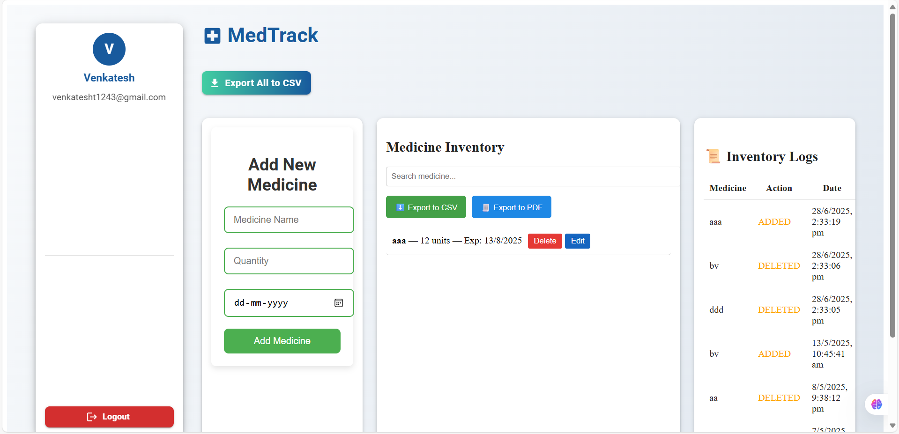

# MedTrack

MedTrack is a full-stack medicine inventory management system designed for clinics, pharmacies, and hospitals. It provides secure user authentication, medicine tracking, expiry notifications, and inventory logs.

---
## 🚀 Live Demo

[https://medtrack-frontend.onrender.com](https://medtrack-frontend.onrender.com)

---


## Features

- **User Authentication:** Register, login, and reset password (with OTP verification).
- **Medicine Management:** Add, edit, delete, and search medicines.
- **Inventory Logs:** Track all inventory changes with detailed logs.
- **Expiry Alerts:** Receive notifications for medicines nearing expiry.
- **Export Data:** Export medicine data to CSV for reporting.

---

## Screenshots

### Dashboard  



## Getting Started

### Prerequisites

- Node.js (v16+)
- MongoDB

### Installation

1. **Clone the repository:**
   ```sh
   git clone https://github.com/yourusername/medtrack.git
   cd medtrack
   ```

2. **Install backend dependencies:**
   ```sh
   cd server
   npm install
   ```

3. **Install frontend dependencies:**
   ```sh
   cd ../frontend
   npm install
   ```

4. **Set up environment variables:**  
   Copy `.env.example` to `.env` in both `server` and `frontend` folders and update values as needed.

5. **Start the backend:**
   ```sh
   cd ../server
   npm start
   ```

6. **Start the frontend:**
   ```sh
   cd ../frontend
   npm start
   ```

7. **Access the app:**  
   Open [http://localhost:3000](http://localhost:3000) in your browser.

---

## Folder Structure

```
medtrack/
  frontend/
    src/
    public/
    ...
  server/
    routes/
    models/
    ...
  screenshots/
    dashboard.png
    
```

---

## License

This project is licensed under the MIT License.

---
